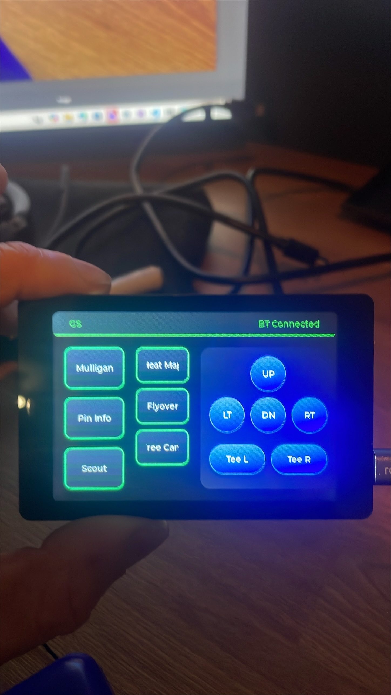

# Hardware Reference Guide

Complete hardware documentation for the GSPRO Controller project.

## Table of Contents

- [Overview](#overview)
- [Recommended Hardware](#recommended-hardware)
- [Technical Specifications](#technical-specifications)
- [Pin Configuration](#pin-configuration)
- [Alternative Hardware](#alternative-hardware)
- [Assembly Instructions](#assembly-instructions)
- [Enclosure Design](#enclosure-design)
- [Power Requirements](#power-requirements)
- [Troubleshooting Hardware](#troubleshooting-hardware)

## Overview

The GSPRO Controller is built using the WT32-SC01 development board, which integrates an ESP32 microcontroller with a 3.5-inch capacitive touchscreen display.

### Why WT32-SC01?

- **All-in-One**: Display, touch, and ESP32 in one board
- **No Wiring**: Everything pre-soldered and tested
- **Cost-Effective**: ~$15-25 USD
- **LVGL Compatible**: Well-supported by LVGL graphics library
- **WiFi Built-In**: ESP32-WROVER-B with excellent WiFi performance

## Recommended Hardware

### Primary Board: WT32-SC01



**Specifications**:
- **Microcontroller**: ESP32-WROVER-B
- **CPU**: Dual-core Tensilica LX6, 240MHz
- **RAM**: 520KB SRAM + 4MB PSRAM
- **Flash**: 4MB or 16MB (both work)
- **Display**: 3.5" TFT LCD, 480x320 pixels
- **Touch**: Capacitive touch panel (FT6336U controller)
- **Display Driver**: ST7796
- **Interface**: SPI
- **Dimensions**: 84mm x 55mm
- **Power**: 5V via USB-C or pin headers

**Purchase Links**:
- AliExpress: Search "WT32-SC01"
- Amazon: Search "WT32-SC01 ESP32"
- Official store: Wireless-Tag

**Expected Price**: $15-25 USD

### Included in Package

When you purchase WT32-SC01, you typically get:
- WT32-SC01 board
- USB-C cable (sometimes)
- Pin headers (not soldered)
- Documentation may vary

### Additional Components (Optional)

#### For Portable/Standalone Use

1. **Battery Pack**
   - 5V USB power bank
   - 2000mAh+ recommended
   - Enables portable operation

2. **Enclosure**
   - 3D printable case (STL files can be designed)
   - Off-the-shelf project box
   - Custom laser-cut acrylic

3. **Mounting Hardware**
   - Velcro strips for attachment
   - Magnetic mount
   - Desktop stand

## Technical Specifications

### ESP32-WROVER-B Module

| Feature | Specification |
|---------|---------------|
| CPU | Dual-core Xtensa LX6, 240MHz |
| ROM | 448KB |
| SRAM | 520KB |
| PSRAM | 4MB (8MB on some variants) |
| Flash | 4MB or 16MB |
| WiFi | 802.11 b/g/n, 2.4GHz only |
| Bluetooth | BLE 4.2 + Classic |
| Operating Voltage | 3.3V (regulated on board) |
| Input Voltage | 5V via USB or VIN |
| GPIO Pins | 32 (many used by display) |
| Temperature Range | -40°C to +85°C |

### Display Module

| Feature | Specification |
|---------|---------------|
| Size | 3.5 inches diagonal |
| Resolution | 480 x 320 pixels |
| Color Depth | 16-bit RGB565 (65K colors) |
| Display Driver | ST7796 |
| Interface | 4-wire SPI |
| Backlight | LED, PWM controllable |
| Viewing Angle | 60°/60°/60°/60° (U/D/L/R) |
| Brightness | ~300 cd/m² |

### Touch Panel

| Feature | Specification |
|---------|---------------|
| Type | Capacitive (PCAP) |
| Controller | FT6336U |
| Interface | I2C |
| Touch Points | Single or dual touch (single used) |
| I2C Address | 0x38 |
| I2C Speed | 400kHz (configurable) |

### Power Consumption

| Mode | Current Draw | Power (5V) |
|------|--------------|-----------|
| Idle (WiFi on) | ~120mA | ~0.6W |
| Active Use | ~180mA | ~0.9W |
| Display Off | ~80mA | ~0.4W |
| Deep Sleep | ~5mA | ~25mW |

**Battery Life Estimates** (with 2000mAh power bank):
- Active use: ~11 hours
- Idle: ~16 hours
- Display off: ~25 hours

## Pin Configuration

### Display Interface (SPI)

| Signal | ESP32 Pin | Description |
|--------|-----------|-------------|
| TFT_MISO | GPIO 12 | SPI MISO (Master In Slave Out) |
| TFT_MOSI | GPIO 13 | SPI MOSI (Master Out Slave In) |
| TFT_SCLK | GPIO 14 | SPI Clock |
| TFT_CS | GPIO 15 | Chip Select |
| TFT_DC | GPIO 21 | Data/Command |
| TFT_RST | GPIO 22 | Reset |
| TFT_BL | GPIO 23 | Backlight PWM Control |

**SPI Configuration**:
- Clock Speed: 40MHz (configurable, can reduce for stability)
- Mode: SPI_MODE0
- Bit Order: MSB First

### Touch Interface (I2C)

| Signal | ESP32 Pin | Description |
|--------|-----------|-------------|
| TOUCH_SDA | GPIO 18 | I2C Data |
| TOUCH_SCL | GPIO 19 | I2C Clock |
| TOUCH_INT | GPIO 39 | Interrupt (optional) |
| TOUCH_RST | GPIO 33 | Reset (optional) |

**I2C Configuration**:
- Address: 0x38
- Speed: 400kHz (can reduce to 100kHz if issues)
- Pull-ups: 4.7kΩ (on board)

### Power Pins

| Pin | Voltage | Description |
|-----|---------|-------------|
| 5V | 5V | Input power (USB or external) |
| 3V3 | 3.3V | Regulated output (max 500mA) |
| GND | 0V | Ground |

### Available GPIO

Most GPIO pins are used by the display and touch panel. Some available pins:

| Pin | Available | Notes |
|-----|-----------|-------|
| GPIO 0 | Limited | Boot mode selection |
| GPIO 2 | Limited | Boot mode selection |
| GPIO 4 | Yes | General purpose |
| GPIO 5 | Yes | General purpose |
| GPIO 16 | Yes | PSRAM conflict on some boards |
| GPIO 17 | Yes | PSRAM conflict on some boards |
| GPIO 25 | Yes | DAC output capable |
| GPIO 26 | Yes | DAC output capable |
| GPIO 27 | Yes | General purpose |
| GPIO 32 | Yes | ADC capable |
| GPIO 34 | Yes | Input only, ADC capable |
| GPIO 35 | Yes | Input only, ADC capable |

**Note**: Be careful with GPIO 16/17 if using PSRAM.

## Alternative Hardware

### Compatible ESP32 + Display Combinations

If WT32-SC01 is unavailable:

#### 1. ESP32 DevKit + ILI9341 Display

**Components**:
- ESP32 DevKit board ($5-8)
- 3.5" ILI9341 touchscreen ($10-15)
- Wiring required

**Pros**:
- Cheaper if you have parts
- More flexible GPIO

**Cons**:
- Requires wiring
- More assembly time
- Less compact

#### 2. ESP32-2432S028 (CYD - Cheap Yellow Display)

**Specifications**:
- 2.8" display (320x240)
- ILI9341 driver
- Resistive touch
- Integrated SD card

**Pros**:
- Very cheap (~$10)
- All-in-one like WT32-SC01

**Cons**:
- Smaller display
- Resistive touch (less responsive)
- Different pin configuration

**Code Changes Required**: Pin definitions in `platformio.ini`

#### 3. LilyGO T-Display S3

**Specifications**:
- ESP32-S3
- 1.9" ST7789 display
- No touch (buttons only)

**Pros**:
- Newer ESP32-S3 chip
- Built-in battery management

**Cons**:
- Much smaller display
- No touch screen
- Significant code changes needed

### Using This Project with Other Hardware

To adapt to different hardware:

1. **Update Pin Definitions** in `platformio.ini`:
```ini
build_flags =
    -D TFT_MISO=12
    -D TFT_MOSI=13
    ; ... update all pins to match your board
```

2. **Change Display Driver** if needed:
```ini
-D ILI9341_DRIVER=1  ; Instead of ST7796_DRIVER
```

3. **Adjust Resolution**:
```ini
-D LV_HOR_RES_MAX=320
-D LV_VER_RES_MAX=240
```

4. **Update Touch Driver** in code if using different controller

## Assembly Instructions

### WT32-SC01 - No Assembly Required!

The WT32-SC01 comes fully assembled. Simply:

1. **Unbox** the board
2. **Connect USB-C** cable to power
3. **Upload firmware** via PlatformIO
4. **Done!**

### Optional: Adding Pin Headers

If you want to access GPIO pins:

1. Board comes with loose pin headers
2. Solder to the side pin pads
3. Be careful not to overheat plastic components
4. Use low-temperature solder (183°C)

### Enclosure Assembly (If Using)

1. **3D Print** or purchase enclosure
2. **Insert** WT32-SC01 board
3. **Route** USB cable through opening
4. **Secure** with screws or clips
5. **Test** before final assembly

## Enclosure Design

### 3D Printable Case

**Dimensions for Design**:
- Board: 84mm x 55mm x 9mm (without USB)
- Display area: 72mm x 50mm
- USB-C cutout: 10mm x 4mm
- Screen bezel: 2-3mm recommended

**Mounting Options**:
- Screw holes: M3 size, 4 corners
- Snap-fit clips
- Friction fit

**Design Considerations**:
- Ventilation holes for ESP32 heat
- Access to USB port
- Optional: cutout for pin headers
- Optional: mounting holes for wall/desk mount

### Commercial Enclosures

**Suitable Project Boxes**:
- Hammond 1551KBK (90x60x25mm)
- Polycase WC-14 (88x63x23mm)

You'll need to drill/cut openings for:
- Display viewing area
- USB-C port
- Optional: power LED

## Power Requirements

### Power Input Options

#### 1. USB-C (Recommended)
- Standard 5V USB power
- 500mA minimum
- 1A recommended
- Any USB charger works

#### 2. Pin Headers (5V/GND)
- Solder to VIN and GND pins
- 5V regulated input required
- Useful for battery integration

#### 3. Battery Power (Portable)
- Use 5V USB power bank
- 2000mAh+ recommended
- Connect via USB-C

### Power Supply Recommendations

**For Desktop Use**:
- Any USB charger (5V, 1A+)
- PC USB port (may be borderline)
- USB hub with power adapter

**For Portable Use**:
- Anker PowerCore series
- RAVPower power banks
- Any 5V USB power bank

**For Embedded Installation**:
- 5V regulated power supply
- 1A+ capacity
- Clean power (low ripple)

### Power Protection

The WT32-SC01 includes:
- Reverse polarity protection
- Over-current protection (fuse)
- ESD protection on USB

**Additional Protection** (optional):
- Add 1000µF capacitor across 5V/GND for stability
- TVS diode for extra ESD protection

## Environmental Considerations

### Operating Conditions

| Parameter | Range |
|-----------|-------|
| Temperature | 0°C to 50°C (recommended) |
| | -20°C to 70°C (absolute max) |
| Humidity | 20% to 80% RH (non-condensing) |
| Altitude | 0 to 2000m |

### Storage Conditions

| Parameter | Range |
|-----------|-------|
| Temperature | -40°C to 85°C |
| Humidity | 5% to 95% RH (non-condensing) |

### Heat Management

ESP32 can get warm (50-70°C) during heavy WiFi use.

**Cooling Tips**:
- Ensure adequate ventilation
- Add heatsink to ESP32 module (optional)
- Don't enclose in airtight case
- Avoid direct sunlight

## Electrical Characteristics

### Current Consumption by Component

| Component | Idle | Active |
|-----------|------|--------|
| ESP32 Core | 40mA | 80mA |
| WiFi Radio | 80mA | 120mA |
| Display | 60mA | 100mA |
| Touch Panel | 5mA | 10mA |
| **Total** | **~120mA** | **~180mA** |

### GPIO Specifications

| Parameter | Value |
|-----------|-------|
| Output Current (per pin) | 40mA max |
| Input Voltage | 0-3.3V |
| Output Voltage | 0-3.3V |
| Pull-up/Pull-down | 45kΩ internal |

## Maintenance

### Cleaning

- **Display**: Microfiber cloth, slightly damp
- **Board**: Compressed air for dust
- **Avoid**: Alcohol on display coating

### Long-Term Storage

- Power off
- Store in anti-static bag
- Cool, dry location
- Avoid extreme temperatures

## Purchasing Guide

### What to Look For

When buying WT32-SC01:
- **Seller reputation** (check reviews)
- **Flash size**: 4MB or 16MB (both work)
- **Warranty/returns** policy
- **Shipping time** (China: 2-4 weeks typically)

### Verified Suppliers

- **AliExpress**: Wireless-Tag official store
- **Amazon**: Various sellers (faster shipping, higher price)
- **Adafruit**: Sometimes in stock (quality assured)
- **DFRobot**: Official distributor

### Red Flags

Avoid:
- Prices too good to be true (<$10)
- No product reviews
- Unclear specifications
- No return policy

## Datasheets

Reference documentation:
- [WT32-SC01 Datasheet](WT32-SC01+DataSheetV3.4++with+16MB.pdf) (included)
- [Getting Started Guide](Getting+Started+Guide+for+WT32-SC01.pdf) (included)
- ESP32-WROVER-B: [Espressif Official](https://www.espressif.com/sites/default/files/documentation/esp32-wrover-b_datasheet_en.pdf)
- ST7796: Search "ST7796 datasheet"
- FT6336U: Search "FT6336U datasheet"

## Troubleshooting Hardware

See [TROUBLESHOOTING.md](TROUBLESHOOTING.md) for detailed hardware troubleshooting.

### Quick Hardware Checks

1. **No Power**: Check USB cable, try different port/charger
2. **Blank Screen**: Check backlight pin, verify upload successful
3. **Touch Not Working**: Verify I2C pins, check touch controller
4. **WiFi Weak**: Check antenna, move closer to router, use 2.4GHz
5. **Overheating**: Ensure ventilation, reduce CPU speed if needed

## Questions?

For hardware questions:
- Open an issue: https://github.com/liamw8lde/GSPRO_Bluetooth_Controller/issues
- Check discussions: https://github.com/liamw8lde/GSPRO_Bluetooth_Controller/discussions
